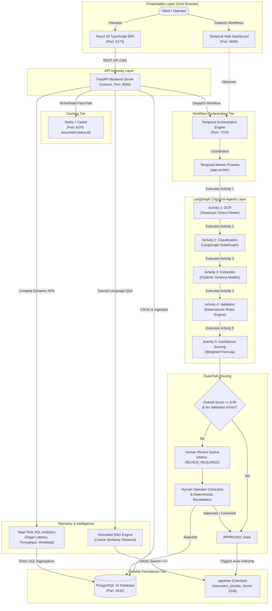

# Multi-Agent Document Processing Factory

> **An AI-powered document processing platform** that combines LangGraph cognitive agents, Temporal workflow orchestration, PostgreSQL/pgvector, Redis, RAG, human-in-the-loop review, and a React dashboard to transform unstructured business documents into validated structured data.

---

[](https://fastapi.tiangolo.com)
[](https://python.org)
[](https://temporal.io)
[](https://langchain.com)
[](https://github.com/pgvector/pgvector)
[](https://redis.io)
[](https://react.dev)
[](backend/tests/)

---

## Table of Contents

1. [Platform Overview](#platform-overview)
2. [Key Features](#key-features)
3. [System Architecture](#system-architecture)
4. [End-to-End Processing Lifecycle](#end-to-end-processing-lifecycle)
5. [Technology Stack](#technology-stack)
6. [Core Architectural Decisions](#core-architectural-decisions)
7. [Confidence Scoring & Routing Logic](#confidence-scoring--routing-logic)
8. [Temporal Workflow Orchestration & Retries](#temporal-workflow-orchestration--retries)
9. [RAG & Vector Retrieval Engine](#rag--vector-retrieval-engine)
10. [Human-in-the-Loop Review System](#human-in-the-loop-review-system)
11. [Operational Analytics & Observability](#operational-analytics--observability)
12. [Service & Port Reference](#service--port-reference)
13. [Local Development Guide](#local-development-guide)
14. [Docker Compose Quickstart](#docker-compose-quickstart)
15. [REST API Directory](#rest-api-directory)
16. [Documentation & Interview Resources](#documentation--interview-resources)

---

## Platform Overview

The **Multi-Agent Document Processing Factory** is an enterprise-grade document intelligence platform designed to eliminate the brittleness, transcription errors, and lack of auditability found in traditional OCR or monolithic LLM pipelines.

Raw business documents—such as invoices, receipts, purchase orders, and contracts—are ingested and coordinated through a series of specialized, stateful AI agents managed by a distributed **Temporal** workflow. The system combines schema-guided structured extraction with deterministic mathematical validation, isolates anomalies into an audited human review queue, stores 1536-dimensional embeddings in **pgvector** for grounded RAG query responses, and provides real-time operational telemetry.

---

## Key Features

- **Document Ingestion**: Multipart file upload supporting PDF, PNG, JPG, JPEG, and DOCX with client and server-side validation.
- **OCR Engine**: Multi-provider text extraction abstraction supporting Tesseract OCR and native PDF text extractors.
- **Document Classification**: LangGraph classification agent categorizing documents (Invoice, Receipt, PO, Contract, Other) using layout and keyword signal analysis.
- **Structured Field Extraction**: Schema-guided extraction into strongly typed Pydantic models with strict typing for line items, financial totals, and dates.
- **Deterministic Validation**: Python business rule validation verifying line-item math ($qty \times price = total$), subtotal sums, tax totals, and date consistency ($due\_date \ge invoice\_date$).
- **Multi-Factor Confidence Scoring**: Weighted confidence calculation ($25\%$ classification, $35\%$ extraction, $40\%$ validation).
- **Automated Dual-Path Routing**: High-confidence documents ($\ge 0.85$ score, 0 validation errors) auto-approve; anomalies route to human review.
- **Human-in-the-Loop Review**: Dedicated review dashboard with side-by-side OCR comparison, field editing, deterministic revalidation, and immutable original extraction history.
- **Temporal Workflow Orchestration**: Durable execution across 5 sequential activities with exponential backoff retries and execution idempotency (`document-processing-{id}`).
- **Redis Status Acceleration**: Low-latency workflow status caching (`TTL=3600s`) with automatic fallback to PostgreSQL on cache failure.
- **PostgreSQL + pgvector**: Unified relational metadata and 1536-dimensional vector embedding storage with atomic transactional cascades.
- **Document Intelligence (RAG)**: Paragraph and page-preserving chunking (800 chars, 120 overlap), cosine similarity search (`<=>`), traceable source citations, and strict zero-hallucination refusals.
- **Real-Time Analytics Dashboard**: Real-time SQL aggregations computing stage latency, success rates, throughput time-series, and review workload without a secondary database.
- **Glassmorphic React Cockpit**: Modern dark-mode React 18 SPA built with TypeScript, SVG visualization, and responsive controls.
- **Production-Hardened Docker Compose**: 8-service containerized architecture with multi-stage builds, non-root user execution, and health-check dependencies.

---

## System Architecture



---

## End-to-End Processing Lifecycle

Each document traverses an 8-stage operational pipeline:

1. **Document Upload**: The client submits a file via `POST /api/v1/documents`. The server validates MIME type, size, and extension, generates a unique storage hash, and persists an `UPLOADED` record.
2. **OCR Extraction**: Activity 1 extracts raw text and records total page counts, page delimiters, and character counts using Tesseract OCR or native document parsing.
3. **Document Classification**: Activity 2 invokes a LangGraph agent that examines layout and keyword signals to classify the document type (`INVOICE`, `RECEIPT`, `PURCHASE_ORDER`, `CONTRACT`, `OTHER`) with a confidence rating.
4. **Structured Information Extraction**: Activity 3 extracts type-specific structured fields into strongly typed Pydantic models (e.g., invoice numbers, vendor details, line items, taxes, totals).
5. **Deterministic Validation**: Activity 4 applies mathematical and business rules (e.g., quantity $\times$ price, subtotal sum, tax addition, and date order consistency) without relying on LLM arithmetic.
6. **Confidence Scoring**: Activity 5 calculates a composite score using the weighted multi-factor formula.
7. **Dual-Path Routing**:
   - **Auto-Approval**: Score $\ge 0.85$ with 0 errors transitions document to `APPROVED`.
   - **Human Review**: Score $< 0.85$ or validation errors transition document to `REVIEW_REQUIRED`, creating a review queue item.
8. **RAG Indexing & Intelligence**: Approved documents are automatically chunked (800 chars, 120 overlap) and indexed into pgvector for natural language querying with source citations.

---

## Technology Stack

| Tier | Technology | Version | Purpose |
|---|---|---|---|
| **Frontend** | React | 18.x / 19.x | Component-driven operational user interface |
| **Frontend Language** | TypeScript | 5.x / 6.x | Strongly typed UI contracts and state management |
| **Build Tool** | Vite | 8.x | High-performance frontend bundling |
| **Web Server** | Nginx | 1.27 Alpine | Production static bundle hosting and SPA fallback proxy |
| **Backend Framework** | FastAPI | 0.115+ | High-throughput asynchronous REST API gateway |
| **Data Validation** | Pydantic | 2.x | Request/response schema validation and extraction schemas |
| **ORM & Database Client**| SQLAlchemy | 2.0 (asyncio) | Asynchronous relational database mappings |
| **Primary Database** | PostgreSQL | 16 | Durable ACID relational persistence |
| **Vector Engine** | pgvector | 0.7+ | Co-located 1536-dimensional vector similarity retrieval (`<=>`) |
| **Status Acceleration** | Redis | 7 Alpine | Sub-millisecond workflow query cache (`TTL=3600s`) |
| **Workflow Engine** | Temporal | 1.25+ | Durable distributed execution and state machine coordination |
| **Workflow SDK** | Temporalio | 1.9+ | Python async workflow and activity definitions |
| **Agentic Framework** | LangGraph | 0.2+ | Directed acyclic cognitive state graphs for classification/extraction |
| **Logging** | structlog | 24.x | JSON-structured structured logging |
| **Containerization** | Docker Compose | v2.38+ | 8-service local and production stack orchestration |
| **Testing** | Pytest | 9.x | 198 unit, activity, workflow, and integration tests |

---

## Core Architectural Decisions

### 1. LangGraph for Agentic Decision-Making
- **Decision**: Represent cognitive operations as directed state graphs (`ClassificationState`, `ExtractionState`, `ValidationState`).
- **Rationale**: Standard sequential scripts lack cycle handling, error propagation, and declarative schema boundaries. LangGraph allows modular node composition and clean provider swapping (OpenAI, Anthropic, or mock doubles) without restructuring business logic.

### 2. Temporal for Distributed Orchestration
- **Decision**: Orchestrate all multi-stage document processing via Temporal rather than Celery or message queues.
- **Rationale**: Celery requires ad-hoc polling and custom database state machines to survive worker crashes. Temporal provides durable execution histories: if a worker dies during extraction, Temporal reassigns the workflow and resumes from the exact activity without re-running earlier steps.

### 3. Redis as an Ephemeral Status Accelerator
- **Decision**: Cache workflow states in Redis while keeping PostgreSQL as the exclusive source of truth.
- **Rationale**: High-frequency frontend polling (every 1–2 seconds) creates database lock contention. Redis absorbs polling traffic. If Redis fails, `RedisService` automatically falls back to PostgreSQL without application failure.

### 4. Co-Located Vector Search with PostgreSQL + pgvector
- **Decision**: Embed vector search directly inside PostgreSQL using the `pgvector` extension rather than an external vector database (Pinecone, Milvus, Qdrant).
- **Rationale**: A separate vector database introduces distributed transaction synchronization issues. With pgvector, `DocumentChunk` records maintain relational foreign keys with `ON DELETE CASCADE`. When a document is rejected or re-indexed, vector chunks update atomically within a single ACID transaction.

### 5. Deterministic Validation Guardrails
- **Decision**: Enforce mathematical consistency via deterministic Python rules rather than relying on LLMs.
- **Rationale**: LLMs are probabilistic language predictors and frequently hallucinate arithmetic totals. Deterministic rules guarantee that line-item sums, taxes, and dates are mathematically verified against hard business logic.

### 6. Human-in-the-Loop Review System
- **Decision**: Provide reviewer correction flows that preserve original AI outputs.
- **Rationale**: Enterprise compliance requires an immutable audit trail. When reviewers correct fields, the system preserves `original_extracted_data`, records `reviewed_extracted_data`, and runs deterministic revalidation before granting approval.

---

## Confidence Scoring & Routing Logic

### The Mathematical Formula

Overall document confidence is calculated as a weighted linear combination of three normalized components:

$$\text{Overall Confidence} = (0.25 \times C_{\text{class}}) + (0.35 \times E_{\text{extract}}) + (0.40 \times V_{\text{valid}})$$

Where:
- $C_{\text{class}} \in [0.0, 1.0]$: Confidence score returned by the classification agent.
- $E_{\text{extract}} \in [0.0, 1.0]$: Extraction completeness ratio (populated fields vs. expected schema fields).
- $V_{\text{valid}} \in [0.0, 1.0]$: Validation score computed by deducting weighted penalties from 1.0:
  $$\text{Penalty} = (N_{\text{error}} \times 0.25) + (N_{\text{warning}} \times 0.08) + (N_{\text{info}} \times 0.02)$$
  $$V_{\text{valid}} = \max(0.0, \min(1.0, 1.0 - \text{Penalty}))$$

### Auto-Approval Criteria
A document is routed to `APPROVED` if and only if:
1. $\text{Overall Confidence} \ge 0.85$ (`AUTO_APPROVAL_THRESHOLD`), **AND**
2. $N_{\text{error}} = 0$ (`is_valid == True`).

If confidence is below $0.85$ or any validation error is detected, the document is routed to `REVIEW_REQUIRED`.

---

## Temporal Workflow Orchestration & Retries

The pipeline runs under `DocumentProcessingWorkflow` with activity-level retry policies:

```python
retry_policy = RetryPolicy(
    initial_interval=timedelta(seconds=2),
    backoff_coefficient=2.0,
    maximum_interval=timedelta(seconds=30),
    maximum_attempts=3,
)
```

### Why Temporal Handles Retries
- **Backoff Without Thread Sleep**: Retries are scheduled by the Temporal cluster without consuming Python worker thread resources.
- **Idempotency Safeguard**: Every workflow run is assigned `id=document-processing-{document_id}`. Duplicate concurrent requests return `WorkflowExecutionAlreadyStartedError` (HTTP 409).
- **Observable Queries**: Live workflow progress is exposed via queries: `get_current_stage()`, `get_status()`, and `get_stages_completed()`.

---

## RAG & Vector Retrieval Engine

Approved documents automatically populate the semantic document intelligence layer:

1. **Chunking Strategy**: Text is divided into 800-character windows with a 120-character sliding overlap. Boundaries strictly respect page markers (`--- Page N ---`, `\x0c`) and paragraph transitions.
2. **Embedding Ingestion**: Chunks are mapped to 1536-dimensional vectors using OpenAI's `text-embedding-3-small` (or `FakeEmbeddingProvider` for deterministic offline testing).
3. **Hybrid Retrieval Query**:
   ```sql
   SELECT * FROM document_chunks
   WHERE document_type = :doc_type AND document_id = :doc_id
   ORDER BY embedding <=> :query_vector
   LIMIT :top_k;
   ```
4. **Strict Grounding & Rejection Safety**:
   - Only `APPROVED` documents are indexed.
   - If a document is rejected during review, its chunks are purged immediately.
   - Grounded prompt constraint: If context is insufficient, the system returns:  
     *"I could not find sufficient evidence in the indexed documents."*

---

## Human-in-the-Loop Review System

Documents in `REVIEW_REQUIRED` enter the human review workflow:

```
[ REVIEW_REQUIRED ] 
       │
       ▼
1. GET /api/v1/review/queue        ──► Reviewer views pending documents
2. POST /api/v1/review/{id}/start  ──► Reviewer claims ownership (IN_REVIEW)
3. POST /api/v1/review/{id}/correct ─► Reviewer submits updated JSON
       │
       ├──► Deterministic Revalidation Engine
       │      ├─ If Valid: status = APPROVED, triggers RAG indexing
       │      └─ If Errors Remain: status = REVIEW_REQUIRED
       ▼
4. Audit Trail: Original AI extraction is preserved in original_extracted_data
```

---

## Operational Analytics & Observability

The analytics module provides real-time operational telemetry computed via optimized SQL aggregations directly over operational tables:

- **Summary Telemetry** (`/api/v1/analytics/summary`): Real-time document counts, auto-approval rates, and active backlog.
- **Stage Performance** (`/api/v1/analytics/stages`): Execution counts, failure counts, success rates (%), and average duration in milliseconds per pipeline stage.
- **Review Workload** (`/api/v1/analytics/reviews`): Pending/in-review workload, average turnaround time (seconds), and reviewer decision distributions.
- **Processing Volume** (`/api/v1/analytics/volume`): Time-series throughput bucketed by day or week.
- **Dialect Compatibility**: Dynamic SQL translation handles `EXTRACT(EPOCH)` on PostgreSQL and `julianday()` on SQLite.

---

## Service & Port Reference

| Service | Internal Container Port | Host Port | Ingress Purpose | Access Context |
|---|---|---|---|---|
| `frontend` | 80 | **5173** | Nginx Web Server / React UI | Host Browser Access |
| `backend` | 8000 | **8000** | FastAPI Application & Swagger Docs | Host Browser & Client API |
| `temporal-ui` | 8080 | **8088** | Temporal Web Dashboard | Host Browser Access |
| `temporal` | 7233 | **7233** | Temporal gRPC Workflow API | Internal Container & Worker |
| `postgres` | 5432 | **5432** | PostgreSQL 16 + pgvector | Internal Network & Host Tools |
| `redis` | 6379 | **6379** | Redis Cache & Status Store | Internal Network & Host Tools |
| `temporal-worker` | None | None | Background Workflow Worker | Internal Processing Only |
| `temporal-admin-tools`| None | None | Namespace Initialization Tool | Runs on startup, exits 0 |

> [!NOTE]
> **Network Boundaries**: Services inside Docker communicate via Docker service names (`postgres:5432`, `redis:6379`, `temporal:7233`). Host browser calls connect via host ports (`localhost:8000`, `localhost:5173`).

---

## Local Development Guide

### Prerequisites
- Python 3.12+
- Node.js 20+ & npm 10+
- Git

### 1. Backend Setup
```bash
cd backend
python -m venv .venv

# Activate virtual environment
# Windows:
.venv\Scripts\activate
# macOS/Linux:
source .venv/bin/activate

# Install dependencies
pip install -r requirements.txt

# Run FastAPI server
uvicorn app.main:app --reload --host 0.0.0.0 --port 8000
```

### 2. Frontend Setup
```bash
cd frontend
npm install
npm run dev
```

### 3. Running Automated Tests
```bash
# Backend pytest suite (198 tests)
cd backend
pytest tests/ -v

# Frontend TypeScript check and Vite production build
cd frontend
npm run build
```

---

## Docker Compose Quickstart

> [!IMPORTANT]
> **Runtime Notice**: Docker Compose configurations and multi-stage Dockerfiles are verified (`docker compose config` passes with code 0). To run containers live, Docker Desktop must be running on your system.

```bash
# 1. Clone repository and setup environment
cp .env.example .env

# 2. Build production images
docker compose build

# 3. Start all 8 services in background
docker compose up -d

# 4. Check container health
docker compose ps

# 5. Tail service logs
docker compose logs -f backend
docker compose logs -f temporal-worker

# 6. Stop stack
docker compose down
```

---

## REST API Directory

The FastAPI backend exposes an interactive OpenAPI specification at [http://localhost:8000/docs](http://localhost:8000/docs).

Detailed endpoint documentation is cataloged in [docs/api/README.md](docs/api/README.md):

- **Documents**: `POST /api/v1/documents`, `GET /api/v1/documents`, `GET /api/v1/documents/{id}`, `DELETE /api/v1/documents/{id}`
- **OCR**: `POST /api/v1/documents/{id}/ocr`, `GET /api/v1/documents/{id}/text`
- **Classification**: `POST /api/v1/documents/{id}/classify`, `GET /api/v1/documents/{id}/classification`
- **Extraction**: `POST /api/v1/documents/{id}/extract`, `GET /api/v1/documents/{id}/extraction`
- **Validation**: `POST /api/v1/documents/{id}/validate`, `GET /api/v1/documents/{id}/validation`
- **Confidence**: `POST /api/v1/documents/{id}/confidence`, `GET /api/v1/documents/{id}/confidence`
- **Processing Workflows**: `POST /api/v1/documents/{id}/process`, `GET /api/v1/documents/{id}/workflow`, `GET /api/v1/documents/{id}/processing-status`
- **Human Review**: `GET /api/v1/review/queue`, `GET /api/v1/review/{id}`, `POST /api/v1/review/{id}/start`, `POST /api/v1/review/{id}/approve`, `POST /api/v1/review/{id}/reject`, `POST /api/v1/review/{id}/correct`
- **Document Intelligence (RAG)**: `POST /api/v1/rag/query`, `POST /api/v1/documents/{id}/index`, `GET /api/v1/documents/{id}/index-status`
- **Operational Analytics**: `GET /api/v1/analytics/summary`, `GET /api/v1/analytics/status-distribution`, `GET /api/v1/analytics/document-types`, `GET /api/v1/analytics/confidence`, `GET /api/v1/analytics/stages`, `GET /api/v1/analytics/reviews`, `GET /api/v1/analytics/volume`, `GET /api/v1/analytics/recent-activity`
- **System Health**: `GET /health`, `GET /health/ready`, `GET /health/dependencies`

---

## Documentation & Interview Resources

Comprehensive engineering documentation is available in the `docs/` directory:

- [docs/demo-checklist.md](docs/demo-checklist.md): 5–10 minute demonstration script with exact URLs and click paths.
- [docs/interview-guide.md](docs/interview-guide.md): 30s/1m/3m elevator pitches, 28 technical Q&As, architecture tradeoffs, and future roadmap.
- [docs/resume-project-description.md](docs/resume-project-description.md): 3 resume bullet options (concise, technical, ATS-focused) and verified technical skills.
- [docs/e2e-validation.md](docs/e2e-validation.md): Technical validation guide with verified PASS/FAIL/BLOCKED status matrix.
- [docs/project-status.md](docs/project-status.md): Complete milestone ledger covering Stages 1–14.
- [docs/architecture/README.md](docs/architecture/README.md): Architecture Decision Records (ADRs) and subsystem specifications.
- [docs/api/README.md](docs/api/README.md): Complete REST API schema reference.

---

## License

Proprietary — All rights reserved.
